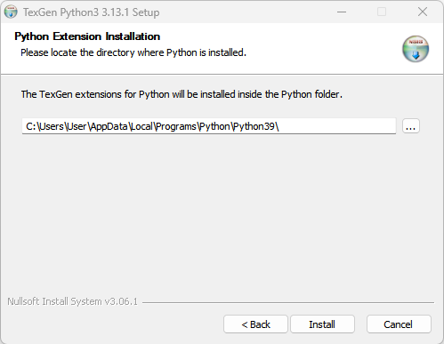

# Integrate `PolyTex` with `TexGen`

`TexGen` software, developed at the [University of Nottingham](https://www.nottingham.ac.uk/research/groups/composites-research-group/meet-the-team/louise.brown), is an excellent tool for building mesoscale models of textile reinforcements and composites. `PolyTex` can be used as a third-party package via Python 3.9 with the latest `TexGen` release (3.13.x). This allows data and methods provided by `PolyTex` to be directly accessed by `TexGen` to build ideal models of woven textiles and textile composites. To do this, you should install the `TexGen` package without Python bundled. A brief description is given below.

## Download `TexGen`

1. **Go to the Project Webpage**: Navigate to the [`TexGen` download page on SourceForge.net](https://sourceforge.net/projects/texgen/) and follow the steps shown in the figure below. Note that you need to download the release without Python bundled.

   

   The `TexGen` file (`texgen-Python39-3.13.1.exe`) indicates that the current `TexGen` package supports only Python 3.9.

2. **Install Python 3.9**: 

   Go to the official website of Python: [Download Python | Python.org](https://www.python.org/downloads/) and select the required Python version (Python 3.9). Here is the link to [Python Release Python 3.9.13](https://www.python.org/downloads/release/python-3913/).

3. **Install `TexGen`**:

   Install the `TexGen` package downloaded in Step 1. `TexGen` will automatically detect the installation of Python 3.9.



4. **Install `PolyTex` in the Python 3.9 Environment**:

   `PolyTex` can be installed simply by executing:

   ```python
   pip install polytex==0.4.5
   ```

   If multiple versions of Python are installed on your computer, specify the Python 3.9 installation directory in the pip command using the `--target=` option:

   ```bash
   pip install polytex==0.4.5 --target=C:/Users/User/AppData/Local/Programs/Python/Python39/Lib/site-packages
   ```
   
   Once the installation is complete, import `PolyTex` in the `TexGen` Python console:
   
   ```python
   import polytex
   ```


   To test if the installation is successful, use the following code:

   ```python
   polytex.__author__
   polytex.__version__
   ```

   This should return the developer and version information of the installed `PolyTex`.

At this point, all functions and data in `PolyTex` can be accessed by `TexGen` to build models. For different fabric structures, different `TexGen` scripts are required. Examples are provided in the `TexGen` repository [louisepb/TexGenScripts: Sample scripts to demonstrate `TexGen` scripting](https://github.com/louisepb/TexGenScripts).